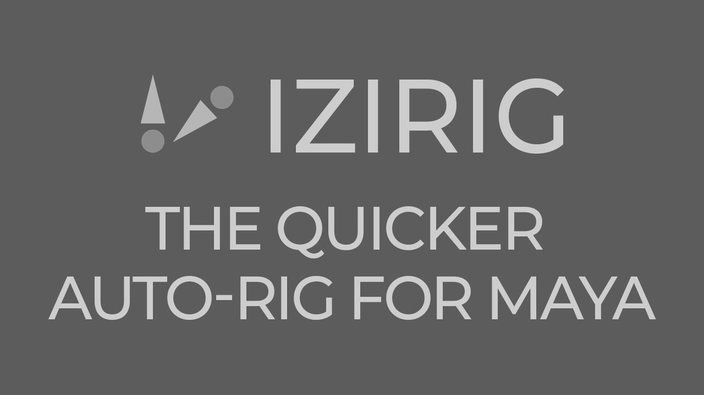
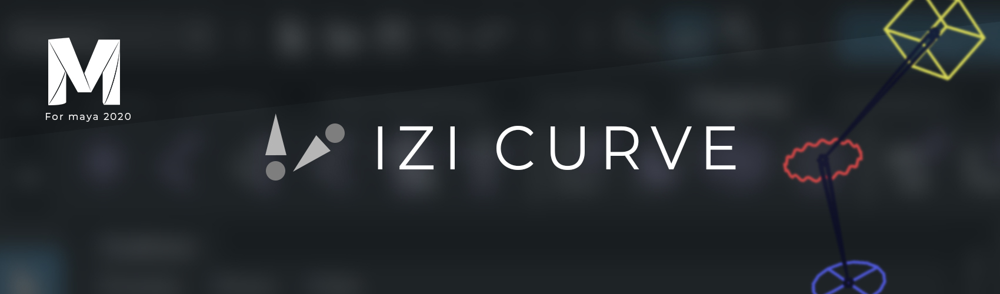
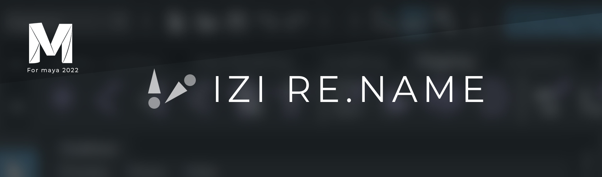

#  IziRig Suite



---

## 📖 Project Overview

IziRig Suite is a documentation-oriented repository about a set of tools developed for Autodesk Maya, focused on rigging automation, controller creation, scene organization and workflow optimization.

The original academic project was developed as **Izi Rig**, later structured as **IziHuman**, the humanoid auto-rigging tool inside the broader IziRig Suite.

The repository focuses on planning, research, UX/UI process, documentation, case study material and project evidence.

---

## 🎓 Academic Context

**Institution:** Universidad Veritas  
**Program:** Digital Animation  
**Project Type:** Graduation Project  
**Author:** Alberto Zúñiga Sánchez  
**Year:** 2021  

The academic scope of the graduation project was limited to implementing the humanoid auto-rigging tool, originally presented as **Izi Rig** and later organized as **IziHuman** inside the suite.

After the university project, the toolset continued evolving into **IziRig Suite**, adding complementary tools such as **IziCurve** and **IziRename**, which were later uploaded and sold through FlippedNormals.

[Read the graduation project document](docs/IZI_RIG_Graduation_Project_ES.pdf)

---

## 🚫 Repository Scope

This repository does **not** include the core source code.

Included:

✅ Planning  
✅ Research  
✅ UX/UI documentation  
✅ User manuals  
✅ Installation manuals  
✅ Case study material  
✅ Academic documentation  
✅ Media references  
✅ Public project evidence  

Excluded:

❌ Core source code  
❌ Internal scripts  
❌ Production builds  
❌ Installers  
❌ Proprietary development files  

---

## 🗂 Repository Structure

```text
docs/
│
├── manuals/
├── planning/
├── software-design/
├── user-research/
└── IZI_RIG_Graduation_Project_ES.pdf

media/
│
├── images/
└── videos-links.md
```

---

## 🧩 Suite Overview

| Logo | Tool | Status | Description |
|---|---|---|---|
|  | IziHuman | Implemented | Humanoid auto-rigging tool originally developed as the graduation project. |
| — | IziCurve | Implemented | Tool for creating and managing curves/controllers inside Maya. |
| — | IziRename | Implemented | Naming utility for Maya scenes and production organization. |
|  | IziSquid | Planned | Planned rigging module for squid-like or tentacle-based characters. |
|  | IziBird | Planned | Planned rigging module for bird characters. |
|  | IziAnimal | Planned | Planned rigging module for animal characters. |

---

## 🧠 Technical Areas

| Area | Description |
|---|---|
| Python | Maya scripting and automation |
| Maya API | Spatial calculations and rig logic |
| Autodesk Maya | Main software environment |
| Tool Development | Internal pipeline tools |
| UI Development | Maya-integrated interfaces |
| Rigging | IK/FK systems, joints and controllers |
| UX/UI | Workflow, usability and interface planning |
| Documentation | Manuals, thesis and technical process |
| Workflow Design | Production planning and tool organization |

---

## 🛠 Main Components

###  IziHuman

IziHuman is the humanoid auto-rigging tool originally presented as **Izi Rig** in the graduation project.

Main workflow:

- Character preparation
- Orientation correction
- Marker placement
- Hand and finger configuration
- Automatic rig generation
- IK/FK rig creation
- Controller generation

---

### IziCurve

IziCurve is a tool for creating curve-based controllers inside Autodesk Maya.

Features:

- General curves
- IziRig curves
- User-created curves
- Orientation setup
- Custom controller storage



---

### IziRename

IziRename is a naming and organization utility for Autodesk Maya scenes.

Features:

- Prefix
- Name
- Suffix
- Padding
- Replace
- Namespace-related options



---

## 📚 Documentation

Available documentation includes:

- Final graduation project document
- User manual
- Functional requirements
- User experience strategy
- Production plan
- Project case study
- Interface design process
- User feedback
- Public video references

---

## 🎥 Media

Project videos and demonstrations are available through the official YouTube channel:

[Visit the IziRig YouTube channel](https://www.youtube.com/@izirig5583)

Additional media references may be organized in:

```text
media/videos-links.md
media/images/
```

---

## 📌 Project Status

Archived / documentation-focused.

IziHuman reached a functional alpha stage as part of the graduation project.  
IziRig Suite continued as a broader toolset after the academic delivery.

---

## 📄 License

This repository uses a documentation-focused license.

The material may be viewed and shared with attribution, but commercial use, modification and derivative works are not permitted.

See [LICENSE](LICENSE).
