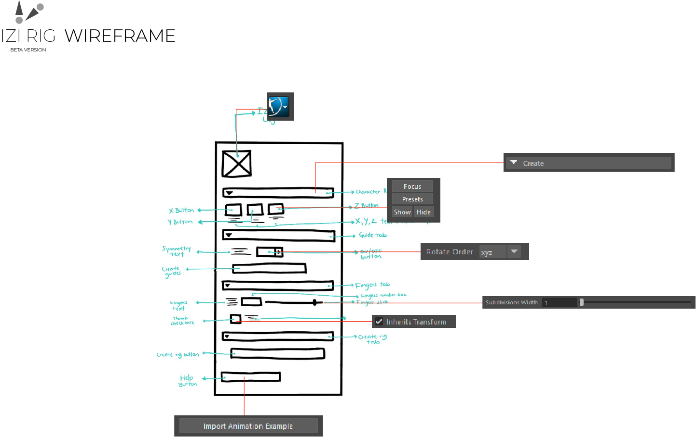
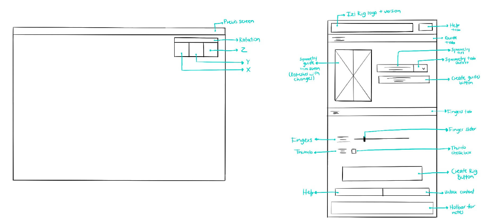
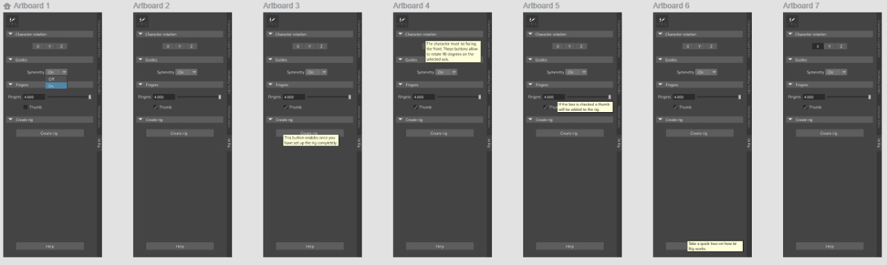
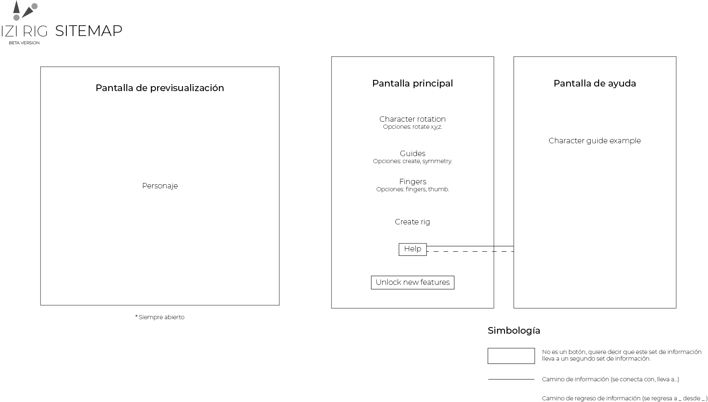

# 🎨 Interface Design Process

This document summarizes the interface design process used during the development of **IziRig**.

The objective of this process was to define the information architecture, navigation structure, interface hierarchy and visual evolution before implementation inside Autodesk Maya.

The process follows UX principles focused on content organization, user flow definition and interface validation before visual production.

---

## User Experience and User Interface

The design process was divided into **UX (User Experience)** and **UI (User Interface)** stages.

UX focused on:

- Content structure
- Navigation flow
- User needs
- Information hierarchy
- Screen organization
- Workflow definition
- Interaction validation

UI focused on:

- Visual layout
- Typography
- Graphic presentation
- Interface refinement
- Final visual hierarchy

The UX process remained active during planning, development and iteration phases while UI translated these decisions into visual components and layouts. 

---

## 🧩 Wireframe

Wireframes were created to define the general interface structure and information hierarchy.

At this stage visual design was intentionally minimized.

The objective was to establish:

- Layout organization
- Content hierarchy
- User flow
- Navigation regions
- Functional grouping

Wireframes acted as planning artifacts rather than final interface proposals.

---

## 📝 Low Fidelity Design

Low fidelity exploration focused on validating interface behavior and early interaction concepts.

This phase was used to:

- Explore navigation
- Validate UX ideas
- Test content hierarchy
- Refine interaction paths

Low fidelity prototypes preserve structure while avoiding unnecessary visual complexity and can evolve continuously during design iterations. 

---

## 🎨 High Fidelity Design

High fidelity exploration translated previous UX decisions into visual interfaces.

This stage explored:

- Final layouts
- Typography
- UI hierarchy
- Visual balance
- Interface presentation

These designs represent exploratory stages and not necessarily the final implementation.

---

## 🗺 Navigation Sitemap

The sitemap defines information distribution and navigation relationships between screens.

Main screens:

- Preview screen
- Main screen
- Help screen

Navigation flow includes:

- Character preparation
- Character orientation
- Marker placement
- Finger setup
- Help navigation
- Rig generation flow

The sitemap focuses on information hierarchy and screen relationships rather than visual placement.

---

## 📌 Notes

The final implementation was constrained by Autodesk Maya interface capabilities and Python tooling available during development.

Due to these limitations visual customization was reduced and priority was given to usability, workflow and user experience.

---

## Design Collaboration

UX/UI exploration and guidance developed collaboratively with:

Stephany Mora Fallas  
UI/UX Designer

LinkedIn: https://www.linkedin.com/in/stephanymoraf/